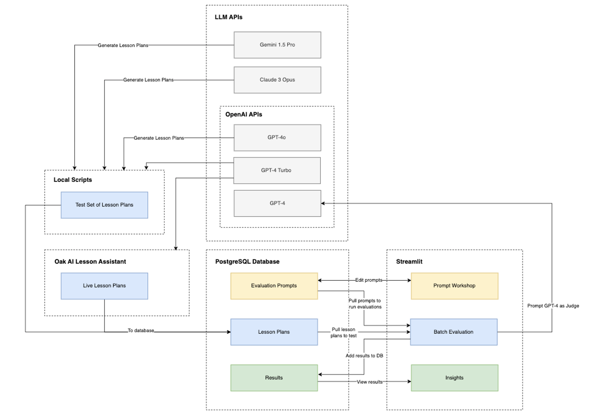
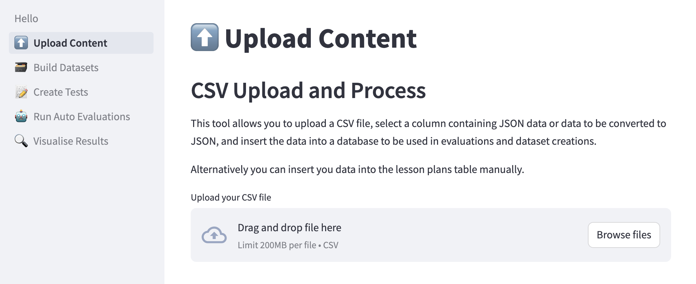
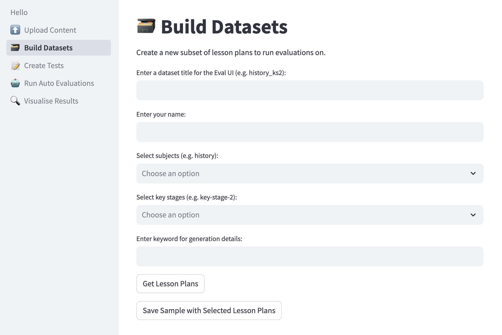
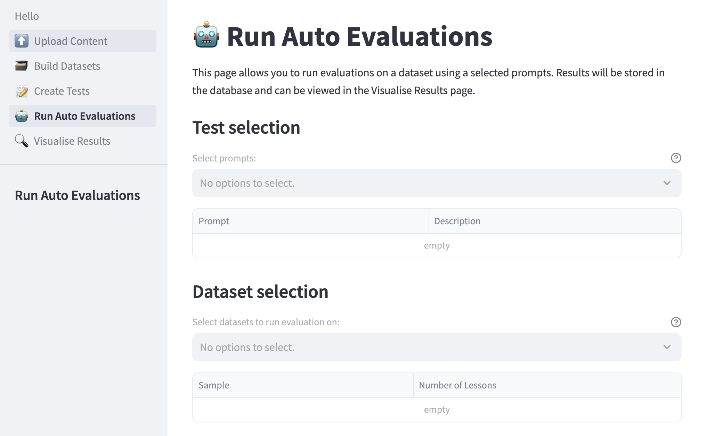
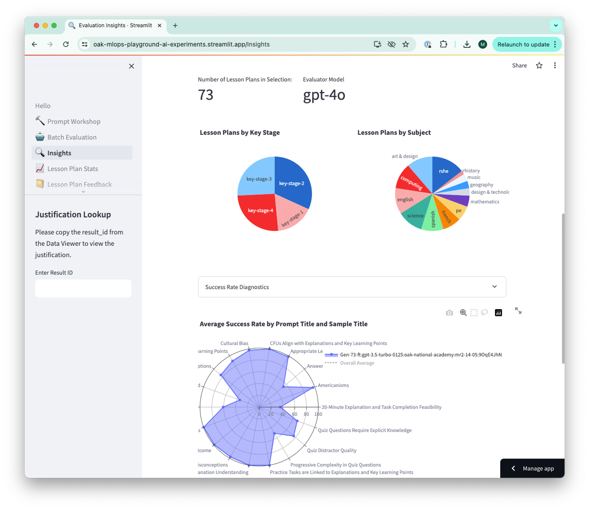

# AutoEval


The AutoEval tool evaluates lesson plans generated by the [Oak AI Lesson Planning Assistant](https://labs.thenational.academy/aila) using a variety of lesson-plan-oriented metrics, mostly using a large language model (LLM) as a judge.

While LLMs can generate highly effective lesson plans, if we wish to improve their performance, we need to benchmark LLMs and prompts against each other in the context of our use case. By doing so, we can verify improvements in a data-driven way.

AutoEval enables users to:

- Upload lesson plans to the database
- Build new sample datasets of lesson plans for evaluation
- Construct new tests to run on a dataset
- Submit tests to be run on a dataset
- View the results of tests

## Table of Contents

- [Installation](#installation)
- [Usage](#usage)
  - [Upload Content](#upload-content)
  - [Build Datasets](#build-datasets)
  - [Create Tests](#create-tests)
  - [Run Auto Evaluations](#run-auto-evaluations)
  - [Visualize Results](#visualize-results)
- [Current Development Work](#current-development-work)
- [Maintainers](#maintainers)
- [Contributing](#contributing)
- [Acknowledgements](#acknowledgements)
- [License](#license)

## Installation

AutoEval utilizes the Streamlit open-source Python framework. A PostgreSQL database is required and the tool is configured to make API calls to OpenAI's LLMs. All AutoEval scripts are contained in the `streamlit` directory of this repository.  

To install AutoEval, follow the following steps:  

1. Clone the repository to run AutoEval locally without making any modifications. Fork the repository if you plan to make changes and experiment with the codebase.

2. Install the requirements.txt file.

    ```bash
    pip install -r streamlit/requirements.txt
    ```

3. Install PostgreSQL.

    Windows:
    - Download the installer for the latest version of PostgreSQL from the [PostgreSQL Downloads](https://www.postgresql.org/download/windows/) page.
    - Run the downloaded installer file.
    - Follow the setup wizard steps.

    macOS:

    ```bash
    /bin/bash -c "$(curl -fsSL https://raw.githubusercontent.com/Homebrew/install/HEAD/install.sh)"
    brew install postgresql
    initdb /usr/local/var/postgres
    brew services start postgresql
    ```

    Ubuntu:

    ```bash
    sudo apt-get update
    sudo apt-get install postgresql postgresql-contrib
    ```

    *You can now use the psql command line tool or pgAdmin to manage your databases.*

4. Create a database and a user.

    ```bash
    psql -U postgres
    CREATE DATABASE mydatabase;
    CREATE USER myusername WITH PASSWORD 'mypassword';
    GRANT ALL PRIVILEGES ON DATABASE mydatabase TO myusername;
    \q
    ```

5. Use `.env.example` as a template to create a .env file for configuration settings, API keys, and database credentials.

6. Run the following command in the terminal to create tables and insert some placeholder data into your database.

    ```bash
    python streamlit/db_setup.py
    ```

7. Run the following command in the terminal to open the app in a new tab in your default browser.

    ```bash
    streamlit run streamlit/Hello.py
    ```

## Usage

A high-level overview of AutoEval functionality is included here.  

More detailed documentation is available in the [documentation directory](docs/).

Overview of the user interface:



### Upload Content

Upload lesson plans as CSV files to be added to the database.



### Build Datasets

Build a new sample dataset from lesson plans available in the database. Lesson plans are selected by Key Stage, subject, and specific keywords. Each new sample dataset is labeled with the name of the creator and a dataset name so that it is available to use for batch evaluations.



### Create Tests

Prompt builder helps users create new tests (prompts) in the correct format for running evaluations.


### Run Auto Evaluations

Run evaluations on a dataset of generated lesson plans.



### Visualize Results

Visualize the results from Batch Evaluation to draw meaningful and actionable insights.



## Current Development Work

- Lesson plan stats
- Lesson plan feedback
- AutoEval feedback

## Maintainers

[@ikaankeskin](https://github.com/ikaankeskin)  
[@mfdowland](https://github.com/mfdowland)  
[@mhodierne1402](https://github.com/mhodierne1402)  

## Contributing

Should you wish to report vulnerabilities to help keep users safe, please see our [security.txt](https://www.thenational.academy/.well-known/security.txt) file.  

We don't currently accept external contributions to the code base, but this is under review and we hope to find an approach that works for us and the community.

## Acknowledgements

As with all web projects we are dependent on open source libraries maintained by others. While it is not practical to acknowledge them all, we would nevertheless like to express our gratitude for the contributions and efforts of the OSS community.

## License

Unless stated otherwise, the codebase is released under the [MIT License](LICENSE).  

This covers both the codebase and any sample code in the documentation. Where any Oak National Academy trademarks or logos are included, these are not released under the [MIT License](LICENSE) and should be used in line with [Oak National Academy brand guidelines](https://support.thenational.academy/using-the-oak-brand).  

Any documentation included is © [Oak National Academy](https://www.thenational.academy/) and available under the terms of the [Open Government Licence v3.0](https://www.nationalarchives.gov.uk/doc/open-government-licence/version/3/) except where otherwise stated.
