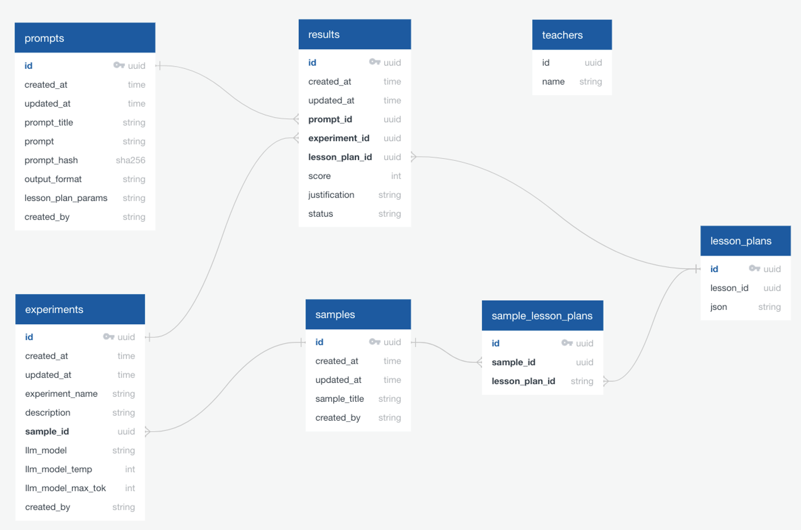

# Database Design Guide

### PostgreSQL Database Schema

### PostgreSQL Database Tables

| Table name | Columns | Purpose |
| --- | --- | --- |
| m_experiments | id, created_at, updated_at, experiment_name, sample_id, llm_model, llm_model_temp llm_max_tok, description, created_by, max_score, min_score, pass_score, tracked | Track evaluations and the model used for them. These set up evaluations / group of evaluations run over a dataset are known as ‘Experiments’. |
| m_gen_lesson_plans / (m_llm_lesson_plans) | id, (number), model, model_temp, subject, key_stage, lesson_title, topic, lesson_plan, (notes) | Generated lesson plans from Hannah-Beth’s 100 Test Lesson Plans dataset Note: ’number’ is the lesson plan number from HB’s 100 Test Lessons |
| m_prompts | id, created_at, updated_at, prompt_objective, lesson_plan_params, output_format, rating_criteria, general_criteria_note, rating_instruction, prompt_hash, prompt_title, experiment_description, objective_title, objective_desc, created_by, version | Jinja2 Prompts separated into their parts |
| m_results | id, created_at, updated_at, experiment_id, prompt_id, lesson_plan_id, result, justification, status | Results from the evaluations |
| m_sample_lesson_plans | id, created_at, updated_at, sample_id, lesson_plan_id | Junction table connecting lesson_plan_ids to sample_ids |
| m_samples | id, created_at, updated_at, sample_title, created_by | Titles and owners of samples |
| m_teachers | id, created_at, name | Names of those running evaluations (experiments) |
| lesson_plans | id, lesson_id, json | All lesson plans (mostly Stef’s RAG-generated lesson plans from Oak lessons, but also includes m_gen_lesson_plans and chat_lesson_plans) |
| chat_lesson_plans | id, json | 109 Lesson Plans generated in the Live app from Matt  |
| m_lesson_reviews | id, experiment_id, result_id, prompt_id, teacher_id, review, lesson_plan_id, created_at | Record of reviews made by users on the judgement of AutoEvals. Note: This isn’t yet in use |
