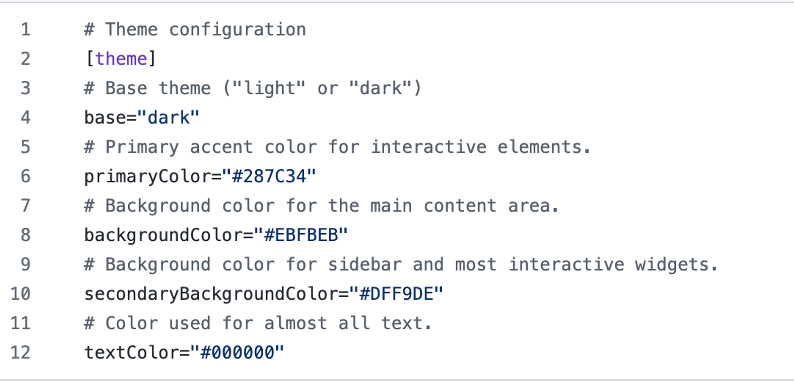
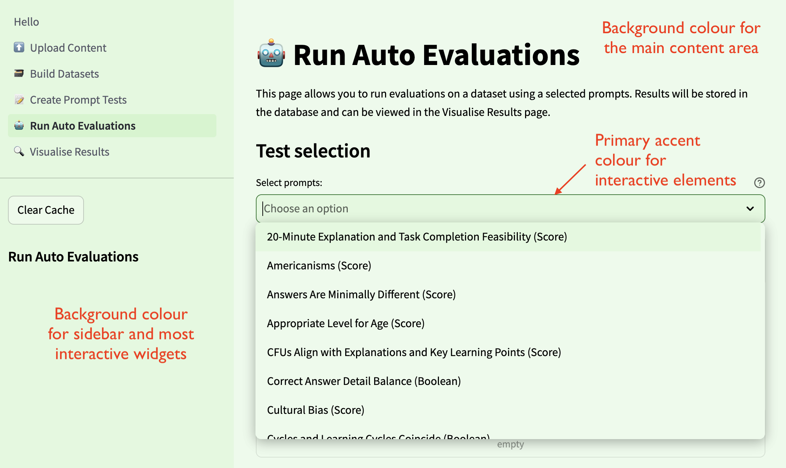

# AutoEval Getting Started: Configuration Guide

### Changing Theme Colours
- In the AutoEval repository is a folder `.streamlit`
- If you are deploying the app on Streamlit, this folder needs to be in the repository root. Otherwise, the folder needs to be in the `streamlit/` directory.
- Inside is the `config.toml` file where the app colours can be changed:

